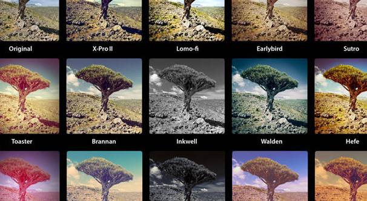
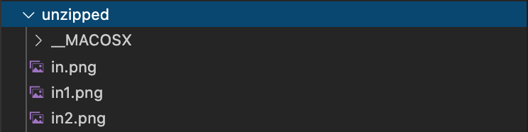

Project Instructions: 

BCIT has asked students in BCIT to design an Instagram-like photo application. 

Assume that the front-end has already been built for you, and your back end will be receiving a zip that will contain photos. 

**You need to design a Node.js application that can extract the zip file and apply filters**

**to these photos.** This assignment is all about getting comfortable working with libraries (both core to Node.js and third-party), reading documentation, writing modular code, and understanding asynchronous programming/streams within web development. 

Note: Apps like Instagram have a lot of filters available, but we’re going to keep this application very simple, and focus only on the “Inkwell” filter, which is basically a grayscale filter (makes a picture black and white). In the future, you could always expand this app so that it supports more filters, and then, it would actually be a pretty neat portfolio project!

### Task:

Your task is to take a zip file containing several images, unzip it, apply a filter to each of the image’s pixel data, save it back into a new image. While this may seem like a challenging task, you will be allowed to use several specific third-party libraries that will greatly simplify the process.

### Details:

Download the starter files folder. Within it, you will find a zip file containing several PNG images, a file called main.js, and a file called ioHandler.js. You must do the following:

(1) In `ioHandler.js`, create a function to unzip the zip file using the "yauzl-promise" library. 

(2) Show the message: "Extraction operation complete", but only after all files are unzipped

The unzipping operation should create a directory called unzipped with all your images in it. 

Note: Be careful. MacOS often will add hidden files into directories (like .DS_Store) or __MACOSX. You might need to keep this in mind when you are working with folders. 

(3) Create another function in `ioHandler.js` called `readDir`. It will take in a directory path as a parameter, and will give back an array of file paths for all the png files that exist in that directory. 

(4) Create another function in `ioHandler.js` called `grayScale` which takes two parameters: `pathIn` and `pathOut`. `pathIn` should represent the path to a png image and `pathOut` represents the output path where your grayscaled image should be placed. This function should do the following:

 Use the `PNGJS` library to parse the pathIn image. This library gives you an array of

pixels representing the PNG image you passed it. Once you have access to this array of pixels, you must:

(1) Loop through the pixel array, modifying the RGB values to create a grayscale filter effect

(2) Save the modified pixel array into a new PNG image which should be written to your pathOut directory.

Hints:

Below is a link explaining some simple algorithms you can use for converting to grayscale

https://tannerhelland.com/2011/10/01/grayscale-image-algorithm-vb6.html

Your code should match the following structure:

- main.js : Entry point to your program. This file should NOT have "logic" in it. It will simply

delegate to the ioHandler.js module you have created to perform the logic required. 

-ioHandler.js: This file should be responsible for performing all core logic. 

Ensure that you make as much of your code as you can Asynchronous, and try to use Promises over callbacks ***whenever possible.***